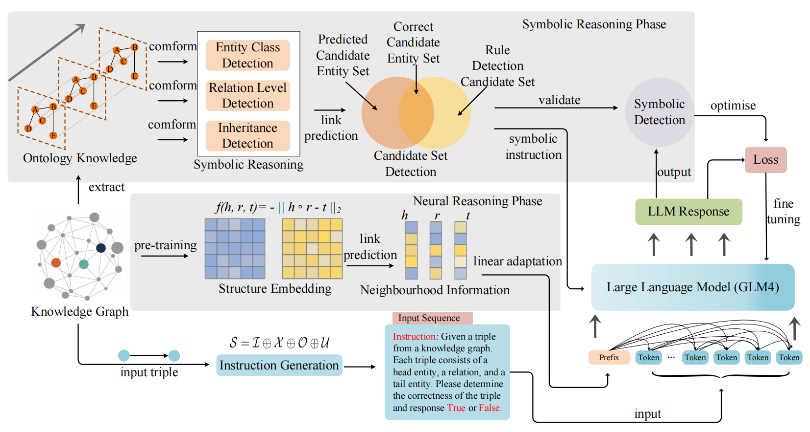

# paper name

 - [Making Large Language Models Perform Better in Knowledge Graph Completion
](https://arxiv.org/abs/2310.06671)

> abstract

## 🌈 Model Architecture



## 🔬 Dependencies
Our code is developed based on [GLM-4](https://github.com/THUDM/GLM-4).


You may need to fill the LLM path and save path before running. The hyper-parameters can be tuned by yourself.

- run inference
```shell
CUDA_VISIBLE_DEVICES=0 python main.py
```


